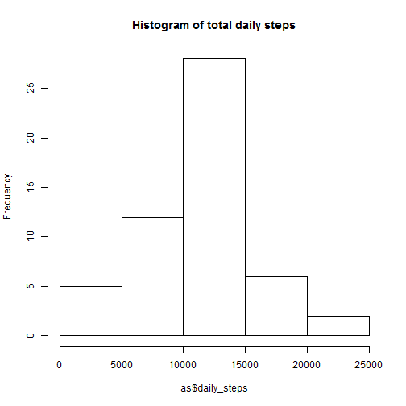
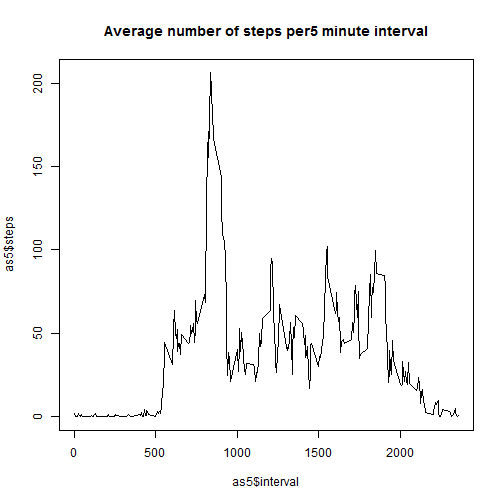
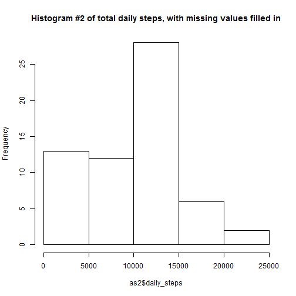
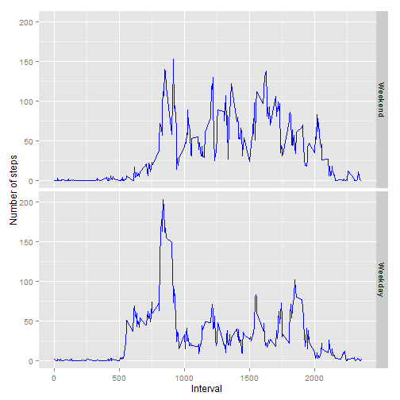

```r
library(dplyr)
```

## Loading and preprocessing the data
Show any code that is needed to

1. Load the data (i.e. read.csv())
2. Process/transform the data (if necessary) into a format suitable for your analysis


```r
if(!file.exists("./activity.zip")) 
    download.file("https://d396qusza40orc.cloudfront.net/repdata%2Fdata%2Factivity.zip","./activity.zip" )
if(!file.exists("./activity.csv")) 
    unzip("./activity.zip" )

a <- read.csv("activity.csv")
summary(a)
```

```
##      steps                date          interval     
##  Min.   :  0.00   2012-10-01:  288   Min.   :   0.0  
##  1st Qu.:  0.00   2012-10-02:  288   1st Qu.: 588.8  
##  Median :  0.00   2012-10-03:  288   Median :1177.5  
##  Mean   : 37.38   2012-10-04:  288   Mean   :1177.5  
##  3rd Qu.: 12.00   2012-10-05:  288   3rd Qu.:1766.2  
##  Max.   :806.00   2012-10-06:  288   Max.   :2355.0  
##  NA's   :2304     (Other)   :15840
```

## What is mean total number of steps taken per day?
For this part of the assignment, you can ignore the missing values in the dataset.

1. Calculate the total number of steps taken per day

```r
as <- summarise(group_by(a, date), daily_steps = sum(steps))
head(as)
```

```
## Source: local data frame [6 x 2]
## 
##         date daily_steps
## 1 2012-10-01          NA
## 2 2012-10-02         126
## 3 2012-10-03       11352
## 4 2012-10-04       12116
## 5 2012-10-05       13294
## 6 2012-10-06       15420
```

2. Make a histogram of the total number of steps taken each day

```r
hist(as$daily_steps, main="Histogram of total daily steps")
```

 

3. Calculate and report the mean and median of the total number of steps taken per day

```r
daily_mean <- mean(as$daily_steps, na.rm = TRUE)
daily_median <- median(as$daily_steps, na.rm = TRUE)
```

Daily mean number of steps is **10766.19**, and the median number of daily steps is **10765**.


## What is the average daily activity pattern?

1. Make a time series plot (i.e. type = "l") of the 5-minute interval (x-axis) and the average number of steps taken, averaged across all days (y-axis)


```r
as5 <- summarise(group_by(a, interval), steps = mean(steps, na.rm=TRUE))
head(as5)
```

```
## Source: local data frame [6 x 2]
## 
##   interval     steps
## 1        0 1.7169811
## 2        5 0.3396226
## 3       10 0.1320755
## 4       15 0.1509434
## 5       20 0.0754717
## 6       25 2.0943396
```

```r
plot(as5$interval, as5$steps, type="l", main="Average number of steps per5 minute interval")
```

 

2. Which 5-minute interval, on average across all the days in the dataset, contains the maximum number of steps?

```r
as5$time <- paste(formatC(floor(as5$interval/100) , width=2, format="d", flag="0"), 
                  ":", 
                  formatC(as5$interval%%100 , width=2, format="d", flag="0"), 
                  sep="")
max <- subset(as5, steps==max(as5$steps))
```

The 5-minute interval that has the maximum number of steps on the average is **835** (08:35), which has **206.2** steps.


## Inputing missing values
Note that there are a number of days/intervals where there are missing values (coded as NA). The presence of missing days may introduce bias into some calculations or summaries of the data.

1. Calculate and report the total number of missing values in the dataset (i.e. the total number of rows with NAs)

```r
missing<-sum(is.na(a$steps))
```

Total number of missing rows: **2304**


2. Devise a strategy for filling in all of the missing values in the dataset. The strategy does not need to be sophisticated. For example, you could use the mean/median for that day, or the mean for that 5-minute interval, etc.

**Strategy:** Use the above calculated mean for the given 5-minute interval as a fill-in for missing values.

3. Create a new dataset that is equal to the original dataset but with the missing data filled in.


```r
# Use the average steps for the relevant interval to fill in missing values for steps
a2<-a
a2NAs <- which(is.na(a2))

a2[a2NAs,]$steps <- as5[as5$interval==a2[head(a2NAs),]$interval,]$steps
summary(a2)
```

```
##      steps                 date          interval     
##  Min.   :  0.000   2012-10-01:  288   Min.   :   0.0  
##  1st Qu.:  0.000   2012-10-02:  288   1st Qu.: 588.8  
##  Median :  0.000   2012-10-03:  288   Median :1177.5  
##  Mean   : 32.578   2012-10-04:  288   Mean   :1177.5  
##  3rd Qu.:  2.094   2012-10-05:  288   3rd Qu.:1766.2  
##  Max.   :806.000   2012-10-06:  288   Max.   :2355.0  
##                    (Other)   :15840
```

4. Make a histogram of the total number of steps taken each day and Calculate and report the mean and median total number of steps taken per day. Do these values differ from the estimates from the first part of the assignment? What is the impact of imputing missing data on the estimates of the total daily number of steps?


```r
as2 <- summarise(group_by(a2, date), daily_steps = sum(steps))
head(as2)
```

```
## Source: local data frame [6 x 2]
## 
##         date daily_steps
## 1 2012-10-01    216.4528
## 2 2012-10-02    126.0000
## 3 2012-10-03  11352.0000
## 4 2012-10-04  12116.0000
## 5 2012-10-05  13294.0000
## 6 2012-10-06  15420.0000
```

```r
hist(as2$daily_steps, main="Histogram #2 of total daily steps, with missing values filled in")
```

 

```r
daily_mean2 <- mean(as2$daily_steps, na.rm = TRUE)
daily_median2 <- median(as2$daily_steps, na.rm = TRUE)
```

Daily mean number of steps, after filling in missing values, is **9382.617**, compared to **10766.19** when just ignoring missing values.

The median number of daily steps, after filling in missing values, is **10395**, compared to **10765** when just ignoring missing values.


## Are there differences in activity patterns between weekdays and weekends?
1. Create a new factor variable in the dataset with two levels - "weekday" and "weekend" indicating whether a given date is a weekday or weekend day.


```r
a2$daytype <- ifelse(weekdays(as.Date(a2$date), abbreviate=TRUE) %in% c("Sat", "Sun"), "Weekend", "Weekday") 
```


2. Make a panel plot containing a time series plot (i.e. type = "l") of the 5-minute interval (x-axis) and the average number of steps taken, averaged across all weekday days or weekend days (y-axis). See the README file in the GitHub repository to see an example of what this plot should look like using simulated data.


```r
as2_grouped <- summarise(group_by(a2, daytype, interval), steps = mean(steps))

library(ggplot2)
ggplot(as2_grouped, aes(x=interval, y=steps)) + geom_line(color="blue") + facet_grid(daytype ~ ., as.table=FALSE) + labs(x="Interval", y="Number of steps") + theme(legend.position="none")
```

 
